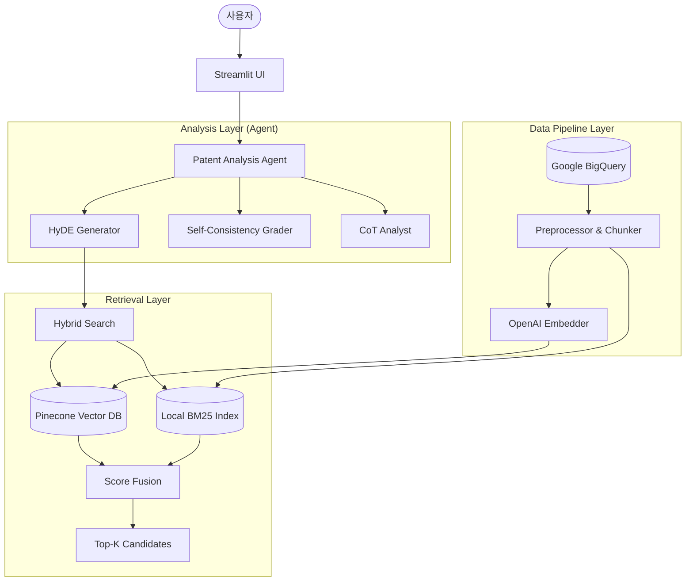

# 🏗 02. 시스템 아키텍처 (System Architecture)

본 문서는 쇼특허(Short-Cut)의 전체 시스템 아키텍처, 데이터 흐름, 핵심 컴포넌트 간의 상호작용을 설명합니다.

---

## 🏛 전체 아키텍처 (High-Level Architecture)

시스템은 크게 **데이터 파이프라인(Data Pipeline)**, **검색 엔진(Retrieval Engine)**, **분석 에이전트(Analysis Agent)**, **사용자 인터페이스(User Interface)** 4가지 레이어로 구성됩니다.

---

## 🔧 핵심 컴포넌트 상세

### 1. 검색 엔진 (Retrieval Engine) - Hybrid Search Strategy

단순한 의미 기반 검색(Semantic Search)의 한계를 극복하기 위해, 키워드 매칭(Sparse)과 의미 매칭(Dense)을 결합했습니다.

- **Dense Retrieval**: `text-embedding-3-small` (1536 dim) + Pinecone Serverless (Cosine Similarity)
- **Sparse Retrieval**: `Pinecone BM25Encoder` (Token matching)
- **Fusion**: **Score Fusion (Weighted Sum)** 방식을 사용하여 두 검색 결과를 통합 및 재정렬 (Rank Aggregation)

### 2. 분석 에이전트 (Analysis Agent) - Self-RAG Flow

단순히 검색된 문서를 요약하는 것이 아니라, 스스로 검색 결과를 평가하고 필요시 재검색하는 **Self-RAG (Self-Reflective RAG)** 구조를 채택했습니다.

1.  **HyDE (Hypothetical Document Embedding)**:
    *   사용자의 아이디어(추상적)를 바탕으로 "가상의 특허 청구항(구체적)"을 생성하여 검색 쿼리로 사용
    *   특허 도메인 특유의 어휘 불일치(Vocabulary Mismatch) 문제 해결
2.  **Self-Grading & Filtering**:
    *   검색된 특허가 사용자의 아이디어와 실제로 관련이 있는지 LLM이 `0.0~1.0` 점수로 자체 평가
    *   평가 점수가 낮을 경우, 쿼리를 재작성(Reformulation)하여 재검색 수행 (Interactive Retrieval)
3.  **Critical CoT Analysis**:
    *   선별된 특허에 대해 **Chain-of-Thought** 프롬프팅을 적용하여 심층 분석 수행
    *   `Similarity` → `Infringement Risk` → `Avoidance Strategy` 단계별 추론

### 3. 데이터 파이프라인 (Data Pipeline)

Google Patents Public Dataset을 활용하여 실시간에 가까운 최신 특허 데이터를 자동 수집 및 가공합니다.

- **Source**: Google BigQuery (`patents-public-data`)
- **Preprocessing**: 계층적 청킹(Hierarchical Chunking)으로 문맥 유지 및 정밀 검색 지원
- **Embedding**: OpenAI Embeddings API 활용

---

## 💾 데이터 흐름 (Data Flow)

### 1. 인덱싱 프로세스 (Indexing Flow)
1.  **Extraction**: BigQuery에서 AI/NLP 도메인 특허 추출 (IPC 필터링)
2.  **Chunking**: 특허를 Parent(문서 전체) - Child(청구항/초록) 구조로 분할
3.  **Embedding**: 텍스트를 벡터로 변환 (OpenAI) + 희소 벡터 생성 (BM25)
4.  **Upsert**: Pinecone Vector DB에 업로드 (Namespace 분리)

### 2. 분석 프로세스 (Inference Flow)
1.  **User Input**: 사용자 아이디어 입력
2.  **Query Expansion**: HyDE를 통한 가상 청구항 생성
3.  **Retrieval**: Dense + Sparse 하이브리드 검색 수행
4.  **Reranking**: 가중치 합산(Weighted Sum) 기반 1차 정렬 및 상위 K개 추출
5.  **Grading**: LLM 기반 관련성 평가 (Low score 시 재검색 Loop)
6.  **Streaming Response**: 분석 결과 실시간 스트리밍 출력

---

## 🛠 기술 스택 (Tech Stack)

| 레이어 | 기술 | 상세 내용 |
|--------|------|-----------|
| **LLM** | **OpenAI** | GPT-4o-mini (Reasoning & Generation) |
| **Embedding** | **OpenAI** | text-embedding-3-small (1536 dim) |
| **Vector DB** | **Pinecone** | Serverless Index (AWS us-east-1) |
| **Search Algo** | **Hybrid** | Dense + Sparse (BM25) with Score Fusion |
| **Data Source** | **BigQuery** | Google Patents Public Data |
| **Backend** | **Python** | Asyncio, Pydantic, Instructor |
| **Frontend** | **Streamlit** | Real-time Streaming UI |
